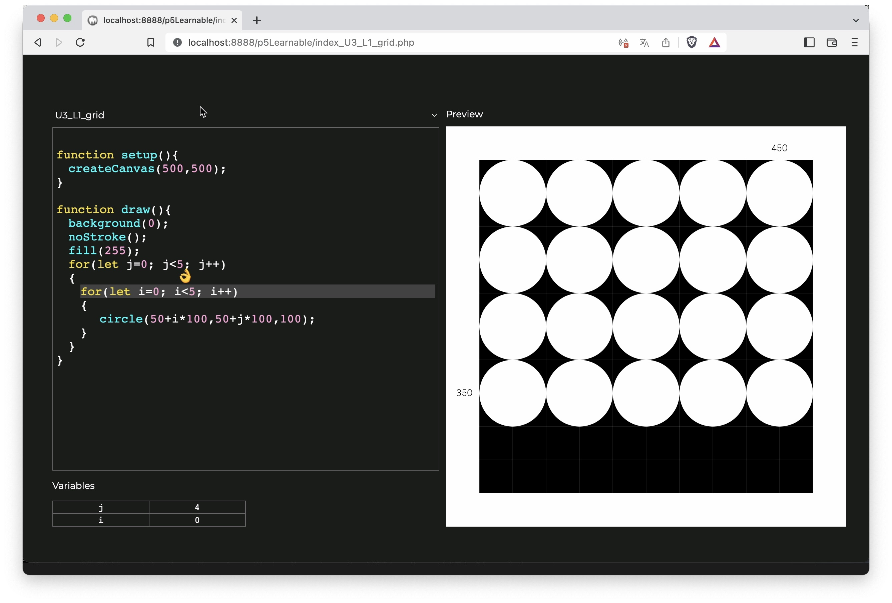

# p5LearnableProgramming

**p5LearnableProgramming** is an experiment and an attempt at showing how code runs into a typical p5.js program, showing how instructions are intepretated in addition to show program state. It was writtent with p5.js itself. 

You can try a few examples here : 
* [Line command](https://v3ga.net/p5LearnableProgramming/index_U2_L2_lines.php)
* [Circle command](https://v3ga.net/p5LearnableProgramming/index_U2_L2_circles.php)
* [Rect command](https://v3ga.net/p5LearnableProgramming/index_U2_L2_rects.php)
* [Triangle command](https://v3ga.net/p5LearnableProgramming/index_U2_L2_triangle.php)
* [Arc command](https://v3ga.net/p5LearnableProgramming/index_U2_L2_arcs.php)
* [For loop structure with circles](https://v3ga.net/p5LearnableProgramming/index_U2_L2_loop.php) 
* [For loop structure with arcs](https://v3ga.net/p5LearnableProgramming/index_U2_L2_loop_arcs.php) 
* [Imbricated For loops](https://v3ga.net/p5LearnableProgramming/index_U3_L1_grid.php)

## References
* Bret Victor — [Learnable Programming](http://worrydream.com/LearnableProgramming/) *Designing a programming system for understanding programs*
* [p5.js](https://p5js.org/) *p5.js is a JavaScript library for creative coding, with a focus on making coding accessible and inclusive for artists, designers, educators, beginners, and anyone else!*
* [3blue1brown](https://www.3blue1brown.com/) *3blue1brown, or 3b1b for short, is primarily a YouTube channel about discovery and creativity in math.*

## Ressources
* [esprima.js](https://esprima.org) *Esprima is a high performance, standard-compliant ECMAScript parser written in ECMAScript (also popularly known as JavaScript).*
* [anime.js](https://animejs.com) *Anime.js (/ˈæn.ə.meɪ/) is a lightweight JavaScript animation library with a simple, yet powerful API.*
* [Relief-SingleLine](https://github.com/isdat-type/Relief-SingleLine) *Relief SingleLine is a versatile sans serif “single-line” font with open paths oriented towards CNC (Computer Numerical Control) engraving and fab labs environments.*

## Ideas, TODOs
* parsing code into html. I was unable to "extract" the parser of [the online editor](https://editor.p5js.org/) which would be ideal. For the moment I used [esprima.js parser and some custom code](https://v3ga.net/p5LearnableProgramming/index_parsing_test.php), though most of the examples were hand written (and it's a very tedious task). 
* implement the parsing of 
  * IF , WHILE , FUNCTION structures 
* implement play / pause functionnalities.
* visualize program state variables : background color, fill color , stroke color, frameCount, ... 
* implement more functions from the p5js library. Here are the implement ones 👉 https://github.com/v3ga/p5LearnableProgramming/blob/master/p5CommandFactory.js 
* Error handling would be awesome. 
